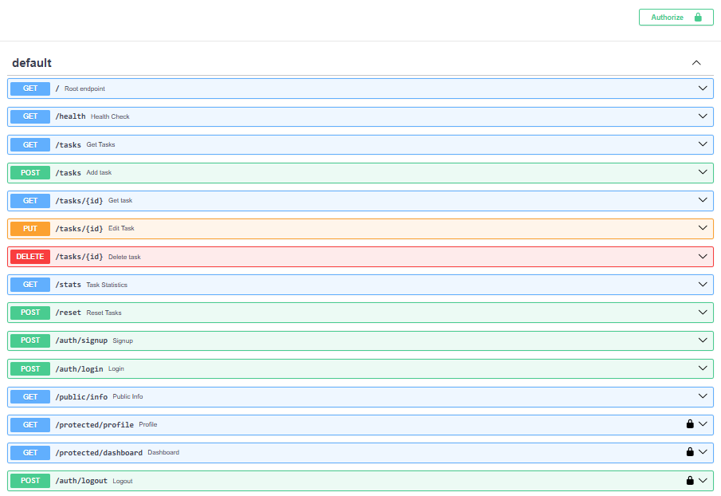

# Task Management API

A lightweight RESTful API built with **Python**, **FastAPI**, and **PostgreSQL**, containerized with **Docker**. The project demonstrates REST API fundamentals, full CRUD operations, input validation, parameterized SQL queries, persistent database storage, SQL filtering, task statistics, environment-based configuration, containerized deployment, and secure authentication with **Supabase Auth**.

The project originally used in-memory storage, was migrated to SQLite, and was subsequently migrated to **PostgreSQL running in Docker** as part of the FlyRank Internship Backend Track.

The project was then extended with **Supabase authentication**, including signup, login, JWT verification, reusable authentication dependencies, protected routes, logout, and Swagger bearer authentication.

---

## Features

### Task API
- Full CRUD operations
  - Create tasks
  - Read tasks
  - Update tasks
  - Delete tasks
- PostgreSQL database storage
- PostgreSQL running in a dedicated Docker container
- FastAPI running in a dedicated Docker container
- Persistent database storage using a Docker volume
- Automatic database and table creation
- Automatic seeding of three example tasks on first database initialization
- Parameterized SQL queries
- Task filtering using query parameters (`?done=true` / `?done=false`)
- Task search by title (`?search=keyword`)
- Task statistics endpoint
- Reset endpoint
- Input validation
- Proper HTTP status code handling
- Environment-based configuration

### Authentication
- Supabase Auth as the Identity Provider
- User signup
- User login
- JWT access tokens
- JWT verification through Supabase
- Reusable FastAPI authentication dependency
- Protected profile endpoint
- Protected dashboard endpoint
- Protected logout endpoint
- Missing, malformed, invalid, and expired token handling
- Swagger UI bearer authentication
- Secrets excluded from Git

---

# Tech Stack

- **Python 3.12**
- **FastAPI**
- **Uvicorn**
- **PostgreSQL**
- **psycopg**
- **python-dotenv**
- **Supabase**
- **Docker**
- **Docker Compose**

---

# Architecture

The application uses two Docker services:

```text
                    ┌──────────────────────┐
                    │       Client         │
                    │ Browser / PowerShell │
                    └──────────┬───────────┘
                               │
                               │ HTTP :8000
                               ▼
                    ┌──────────────────────┐
                    │    FastAPI API       │
                    │      Container       │
                    │                      │
                    │  Uvicorn + FastAPI   │
                    └──────────┬───────────┘
                               │
                               │ PostgreSQL
                               │ :5432
                               ▼
                    ┌──────────────────────┐
                    │    PostgreSQL        │
                    │      Container       │
                    │                      │
                    │      tasks DB        │
                    └──────────┬───────────┘
                               │
                               ▼
                    ┌──────────────────────┐
                    │   Docker Volume      │
                    │   Persistent Data    │
                    └──────────────────────┘
```

Authentication adds Supabase as the external Identity Provider:

```text
Client
  │
  │ email + password
  ▼
Supabase Auth
  │
  │ JWT access token
  ▼
Client
  │
  │ Authorization: Bearer <token>
  ▼
FastAPI
  │
  │ verify token
  ▼
Supabase Auth
  │
  │ verified user
  ▼
Protected route
```

The API does **not** connect to PostgreSQL through `localhost` when running inside Docker.

Instead, Docker Compose provides an internal network and the API connects to PostgreSQL using the database service name.

For example:

```text
postgresql://postgres:password@db:5432/tasks
```

Here, `db` is the PostgreSQL Docker Compose service name.

---

# Project Structure

```text
.
├── main.py
├── database.py
├── supabase_client.py
├── requirements.txt
├── Dockerfile
├── docker-compose.yml
├── .dockerignore
├── .gitignore
├── .env.example
└── README.md
```

Environment files containing secrets are intentionally excluded from Git.

---

# Environment Variables

The application uses environment variables for database and Supabase configuration.

A local `.env` file contains the actual configuration.

Example:

```env
DATABASE_URL=postgresql://postgres:your_password@db:5432/tasks
SUPABASE_URL=your_supabase_project_url
SUPABASE_KEY=your_supabase_anon_key
```

The actual `.env` file should **never be committed to Git**.

A `.env.example` file can be committed instead:

```env
DATABASE_URL=postgresql://postgres:your_password@db:5432/tasks
SUPABASE_URL=your_supabase_project_url
SUPABASE_KEY=your_supabase_anon_key
```

The `SUPABASE_KEY` used by this project is the **anon/public key**. The Supabase `service_role` key must not be placed in this project or exposed to clients.

---

# Supabase Authentication

Supabase Auth is used as the project's **Identity Provider**.

The application does not store passwords or implement password hashing itself.

Supabase is responsible for:
- Managing user accounts
- Handling passwords
- Authenticating login credentials
- Issuing access and refresh tokens
- Verifying authenticated users

The FastAPI application is responsible for:
- Receiving authentication requests
- Passing signup/login credentials to Supabase
- Extracting bearer tokens from incoming requests
- Verifying access tokens with Supabase
- Protecting routes using a reusable authentication dependency
- Returning the authenticated user's safe information

## Supabase Configuration

The Supabase project URL and anon key are stored in environment variables.

For this educational project, email confirmation was disabled in Supabase so a newly registered user can immediately log in.

In a production application, email confirmation should normally remain enabled.

---

# Authentication Flow

The authentication flow works as follows:

```text
1. Client
   │
   │ POST /auth/signup
   │ email + password
   ▼
2. FastAPI
   │
   │ supabase.auth.sign_up(...)
   ▼
3. Supabase Auth
   │
   │ creates account
   ▼
4. Client
   │
   │ POST /auth/login
   ▼
5. Supabase Auth
   │
   │ validates credentials
   │
   │ returns access token + refresh token
   ▼
6. Client
   │
   │ Authorization: Bearer <access_token>
   ▼
7. FastAPI authentication dependency
   │
   │ supabase.auth.get_user(token)
   ▼
8. Supabase
   │
   │ verifies token
   ▼
9. Protected route
```

The access token is a JWT and is sent with protected requests using:

```text
Authorization: Bearer <access_token>
```

---

# Authentication Endpoints

| Method | Endpoint | Description | Auth Required | Success |
|---|---|---|---|---|
| **POST** | `/auth/signup` | Create a new user account | No | **201 Created** |
| **POST** | `/auth/login` | Authenticate and return tokens | No | **200 OK** |
| **POST** | `/auth/logout` | End the authenticated session | Yes | **204 No Content** |
| **GET** | `/protected/profile` | Return authenticated user information | Yes | **200 OK** |
| **GET** | `/protected/dashboard` | Example protected endpoint | Yes | **200 OK** |
| **GET** | `/public/info` | Public information | No | **200 OK** |

---

# Signup

The signup endpoint creates a new Supabase Auth user.

```text
POST /auth/signup
```

Example request:

```json
{
  "email": "test@example.com",
  "password": "password123"
}
```

The endpoint validates that both fields are present.

Missing email or password returns:

```text
400 Bad Request
```

A successful signup returns:

```text
201 Created
```

The password is never stored by the FastAPI application.

---

# Login

The login endpoint authenticates the user through Supabase Auth.

```text
POST /auth/login
```

Example request:

```json
{
  "email": "test@example.com",
  "password": "password123"
}
```

Successful authentication returns the Supabase access and refresh tokens:

```json
{
  "access_token": "eyJ...",
  "refresh_token": "..."
}
```

Successful login:

```text
200 OK
```

Missing credentials:

```text
400 Bad Request
```

Invalid credentials:

```text
401 Unauthorized
```

with:

```json
{
  "detail": "Invalid login credentials"
}
```

---

# Protected Routes

Protected routes require a valid bearer token.

The client must send:

```text
Authorization: Bearer <access_token>
```

For example:

```text
GET /protected/profile
```

Without a token, the API returns:

```text
401 Unauthorized
```

with an authentication error.

The token is not trusted merely because it exists.

The authentication dependency extracts the token and asks Supabase to verify it.

---

# JWT Verification

The API verifies access tokens using Supabase rather than implementing JWT cryptography manually.

Conceptually:

```python
response = supabase.auth.get_user(token)
```

If Supabase successfully verifies the token, the authenticated user is made available to the protected route.

Invalid, expired, or tampered tokens are rejected with:

```text
401 Unauthorized
```

This means changing even one character of a valid JWT causes verification to fail.

The application does not decode a token and blindly trust its contents.

---

# Reusable Authentication Dependency

Authentication is implemented as a reusable FastAPI dependency instead of duplicating token verification in every protected endpoint.

The dependency:

1. Reads the `Authorization` header.
2. Checks that it uses the `Bearer` scheme.
3. Extracts the access token.
4. Rejects missing or malformed authentication.
5. Sends the token to Supabase for verification.
6. Rejects invalid or expired tokens.
7. Provides the authenticated user to the protected route.

Protected routes can then reuse the same dependency:

```python
Depends(get_current_user)
```

This keeps authentication logic centralized and allows additional protected routes to use the same guard without copying authentication code.

---

# Logout

Logout is a protected endpoint:

```text
POST /auth/logout
```

The request must contain a valid bearer token.

The endpoint uses Supabase Auth to sign out the authenticated session.

Successful logout returns:

```text
204 No Content
```

---

# Public Endpoint

The API also contains a route that does not require authentication:

```text
GET /public/info
```

It returns:

```json
{
  "message": "Welcome stranger! This info is public."
}
```

This demonstrates the difference between public and protected API routes.

---

# Swagger UI

FastAPI automatically generates interactive API documentation.

| Documentation | URL |
|---|---|
| Swagger UI | `http://localhost:8000/docs` |
| ReDoc | `http://localhost:8000/redoc` |

Swagger UI is configured with bearer authentication for the protected routes.

The **Authorize** button allows an access token to be entered once and then reused when testing protected endpoints.

### Swagger Screenshot



---

# Docker

The project uses Docker to separate the API and database into independent services.

## API Container

The API container contains:

- Python
- FastAPI
- Uvicorn
- psycopg
- Supabase client
- Application source code

The API exposes port `8000`.

## PostgreSQL Container

The PostgreSQL container contains:

- PostgreSQL
- The `tasks` database
- Database tables and data

PostgreSQL uses port `5432` internally.

The database data is stored using a Docker volume so that database contents survive container recreation.

---

# Running the Application

## 1. Start Docker

Make sure Docker Desktop is running.

## 2. Configure `.env`

Create a `.env` file containing:

```env
DATABASE_URL=postgresql://postgres:your_password@db:5432/tasks
SUPABASE_URL=your_supabase_project_url
SUPABASE_KEY=your_supabase_anon_key
```

Do not commit this file.

## 3. Build and Start the Services

From the project root:

```powershell
docker compose up --build
```

This starts:

```text
api-1
db-1
```

The API becomes available at:

```text
http://localhost:8000
```

Swagger is available at:

```text
http://localhost:8000/docs
```

## 4. Run in Detached Mode

```powershell
docker compose up --build -d
```

Check the running containers:

```powershell
docker compose ps
```

## 5. View Logs

```powershell
docker compose logs
```

Follow the logs:

```powershell
docker compose logs -f
```

API only:

```powershell
docker compose logs api
```

PostgreSQL only:

```powershell
docker compose logs db
```

## 6. Stop the Application

```powershell
docker compose down
```

Stopping the containers does not remove the database volume, so PostgreSQL data remains persistent.

---

# PostgreSQL Database

The application uses PostgreSQL instead of SQLite.

The database is named:

```text
tasks
```

The PostgreSQL server runs inside the `db` Docker container.

The API connects to it through Docker's internal network.

The connection is configured through:

```text
DATABASE_URL
```

Inside Docker:

```text
db:5432
```

rather than:

```text
localhost:5432
```

because `localhost` inside the API container refers to the API container itself, not the PostgreSQL container.

---

# Database Persistence

PostgreSQL data is stored using a Docker volume.

This means:

1. The PostgreSQL container can be stopped.
2. The PostgreSQL container can be recreated.
3. The database data remains available.

The volume is managed by Docker rather than being stored inside the API container.

---

# Database Schema

The application uses a `tasks` table.

| Column | Type | Description |
|---|---|---|
| `id` | SERIAL | Automatically generated primary key |
| `title` | TEXT | Task title |
| `done` | BOOLEAN | Completion status |

The table is created automatically when the application starts.

Conceptually:

```sql
CREATE TABLE IF NOT EXISTS tasks (
    id SERIAL PRIMARY KEY,
    title TEXT NOT NULL,
    done BOOLEAN NOT NULL
);
```

---

# Database Initialization

When the API starts, it initializes the database.

The application:

1. Connects to PostgreSQL.
2. Creates the `tasks` table if it does not already exist.
3. Checks whether the table contains any tasks.
4. Inserts the default sample tasks if the table is empty.

The initial tasks are:

```text
Homework
Read a book
Brainrot
```

---

# API Endpoints

| Method | Endpoint | Description | Success Status | Auth |
|---|---|---|---|---|
| **GET** | `/` | API information | **200 OK** | No |
| **GET** | `/health` | Health check | **200 OK** | No |
| **GET** | `/tasks` | Retrieve all tasks | **200 OK** | No |
| **GET** | `/tasks/{id}` | Retrieve a task by ID | **200 OK** | No |
| **POST** | `/tasks` | Create a new task | **201 Created** | No |
| **PUT** | `/tasks/{id}` | Update an existing task | **200 OK** | No |
| **DELETE** | `/tasks/{id}` | Delete a task | **204 No Content** | No |
| **GET** | `/stats` | Retrieve task statistics | **200 OK** | No |
| **POST** | `/reset` | Restore default tasks | **200 OK** | No |
| **POST** | `/auth/signup` | Create an account | **201 Created** | No |
| **POST** | `/auth/login` | Log in and receive tokens | **200 OK** | No |
| **POST** | `/auth/logout` | Log out | **204 No Content** | Yes |
| **GET** | `/protected/profile` | Get authenticated user | **200 OK** | Yes |
| **GET** | `/protected/dashboard` | Protected dashboard | **200 OK** | Yes |
| **GET** | `/public/info` | Public information | **200 OK** | No |

---

# Query Parameters

The `GET /tasks` endpoint supports optional query parameters.

| Parameter | Example | Description |
|---|---|---|
| `done` | `/tasks?done=true` | Returns completed tasks |
| `done` | `/tasks?done=false` | Returns incomplete tasks |
| `search` | `/tasks?search=book` | Searches task titles |
| Combined | `/tasks?done=true&search=book` | Applies both filters |

---

# Statistics

The API provides:

```text
GET /stats
```

Example response:

```json
{
  "total": 5,
  "done": 2,
  "open": 3
}
```

The statistics are calculated directly using SQL aggregation.

---

# Reset Tasks

The API provides:

```text
POST /reset
```

This deletes the current tasks and recreates:

```text
Homework
Read a book
Brainrot
```

---

# Error Responses

The API uses appropriate HTTP status codes.

| Status Code | Description |
|---|---|
| **400 Bad Request** | Invalid input or missing required fields |
| **401 Unauthorized** | Missing, malformed, invalid, or expired authentication token |
| **404 Not Found** | Requested task does not exist |
| **204 No Content** | Successful operation with no response body |

Authentication errors use JSON error responses.

For example:

```json
{
  "detail": "Invalid or expired token"
}
```

---

# Example Authentication Requests

The following examples use PowerShell.

## Sign Up

```powershell
$body = @{
    email = "test@example.com"
    password = "password123"
} | ConvertTo-Json

(Invoke-WebRequest `
    -Method POST `
    -Uri "http://localhost:8000/auth/signup" `
    -Headers @{"Content-Type"="application/json"} `
    -Body $body).Content
```

Expected:

```text
201 Created
```

## Login

```powershell
$body = @{
    email = "test@example.com"
    password = "password123"
} | ConvertTo-Json

$response = Invoke-WebRequest `
    -Method POST `
    -Uri "http://localhost:8000/auth/login" `
    -Headers @{"Content-Type"="application/json"} `
    -Body $body

$response.Content
```

The response contains an `access_token`.

## Call Protected Profile

Copy the access token from the login response:

```powershell
$token = "PASTE_ACCESS_TOKEN_HERE"

(Invoke-WebRequest `
    -Method GET `
    -Uri "http://localhost:8000/protected/profile" `
    -Headers @{"Authorization"="Bearer $token"}).Content
```

A valid token returns the authenticated user's safe information.

## Test a Missing Token

```powershell
Invoke-WebRequest `
    -Method GET `
    -Uri "http://localhost:8000/protected/profile"
```

Expected:

```text
401 Unauthorized
```

## Test a Tampered Token

Change one character of the access token and send it again.

Expected:

```text
401 Unauthorized
```

This demonstrates that the API does not trust a modified JWT.

## Logout

```powershell
(Invoke-WebRequest `
    -Method POST `
    -Uri "http://localhost:8000/auth/logout" `
    -Headers @{"Authorization"="Bearer $token"}).StatusCode
```

Expected:

```text
204
```

---

# Example Task Requests

## Get All Tasks

```powershell
(Invoke-WebRequest `
    -Method GET `
    -Uri "http://localhost:8000/tasks").Content
```

## Get a Task

```powershell
(Invoke-WebRequest `
    -Method GET `
    -Uri "http://localhost:8000/tasks/1").Content
```

## Create a Task

```powershell
(Invoke-WebRequest `
    -Method POST `
    -Uri "http://localhost:8000/tasks" `
    -Headers @{"Content-Type"="application/json"} `
    -Body '{"title":"Complete Assignment 4"}').Content
```

## Update a Task

```powershell
(Invoke-WebRequest `
    -Method PUT `
    -Uri "http://localhost:8000/tasks/1" `
    -Headers @{"Content-Type"="application/json"} `
    -Body '{"title":"Updated Title","done":true}').Content
```

## Delete a Task

```powershell
(Invoke-WebRequest `
    -Method DELETE `
    -Uri "http://localhost:8000/tasks/1").StatusCode
```

## Filter Completed Tasks

```powershell
(Invoke-WebRequest `
    -Method GET `
    -Uri "http://localhost:8000/tasks?done=true").Content
```

## Search Tasks

```powershell
(Invoke-WebRequest `
    -Method GET `
    -Uri "http://localhost:8000/tasks?search=book").Content
```

---

# Parameterized Queries

The application uses parameterized SQL queries instead of directly concatenating user input into SQL statements.

For example:

```sql
SELECT id, title, done
FROM tasks
WHERE id = %s
```

The value is supplied separately:

```python
cursor.execute(query, (id,))
```

This prevents user-controlled values from being directly inserted into SQL statements and protects the database against SQL injection.

---

# Validation Rules

The API validates incoming requests before processing them.

- Task title is required.
- Task title cannot be empty.
- Task title cannot contain only whitespace.
- Empty update request bodies are rejected.
- The `done` field must be a boolean when provided.
- Requests for non-existent tasks return `404 Not Found`.
- Signup requires an email and password.
- Login requires an email and password.
- Protected routes require a valid bearer token.

---

# Security and Secrets

Sensitive configuration is stored in environment variables rather than committed to the repository.

The `.gitignore` file excludes:

```gitignore
.env
.env.local
```

The Supabase `service_role` key must never be committed or exposed.

The application only requires the Supabase project URL and anon/public key for this implementation.

A safe `.env.example` file documents the required variables without exposing real credentials.

---

# Docker Ignore

Typical `.dockerignore` exclusions include:

```text
.venv/
venv/
__pycache__/
*.pyc
.git/
.env
```

This keeps the Docker build context smaller and prevents local virtual environments and secrets from being copied into the image.

---

# Assignment Progress

## Stage 0 — Initial Task API / Supabase Setup

- Created the FastAPI application.
- Implemented the original CRUD endpoints.
- Added task validation.
- Added filtering and search functionality.
- Added statistics and reset functionality.
- Created the Supabase project.
- Configured the Supabase client.
- Added Supabase environment variables.
- Verified the application starts successfully with Docker.

## Stage 1 — Database Migration

- Migrated the API from in-memory storage to database-backed storage.
- Added database initialization.
- Added database seeding.
- Updated CRUD operations to use SQL queries.

## Stage 2 — PostgreSQL Migration

- Replaced SQLite with PostgreSQL.
- Added `psycopg`.
- Added PostgreSQL connection configuration.
- Moved database configuration into environment variables.
- Updated SQL syntax from SQLite to PostgreSQL.
- Verified the API can connect to PostgreSQL.

## Stage 3 — Dockerization

- Created a Docker image for the FastAPI API.
- Created a PostgreSQL Docker container.
- Connected the API container to the PostgreSQL container.
- Configured the API to communicate with PostgreSQL through the Docker network.
- Added Docker volume persistence for PostgreSQL.

## Stage 4 — Containerized Application Testing

- Started both API and PostgreSQL services with Docker Compose.
- Verified PostgreSQL initializes successfully.
- Verified the API connects to the database container.
- Tested API endpoints through `localhost:8000`.
- Verified task creation and persistence.

## Stage 5 — Authentication

- Added Supabase Auth signup.
- Added Supabase Auth login.
- Added validation for missing authentication credentials.
- Added JWT access-token handling.
- Added public and protected routes.
- Added bearer-token extraction.
- Added Supabase token verification.
- Added reusable FastAPI authentication dependency.
- Protected multiple endpoints with the same authentication dependency.
- Added logout.
- Added Swagger bearer authentication.

## Stage 6 — Documentation and Publishing

- Updated project documentation to reflect authentication.
- Documented the Supabase authentication flow.
- Documented protected and public endpoints.
- Documented bearer authentication.
- Added Swagger authentication instructions.
- Added a dedicated location for the Swagger screenshot.
- Documented environment variables and secret handling.
- Prepared the repository for publication.

---

# Learning Objectives

This project demonstrates:

- RESTful API design
- FastAPI fundamentals
- CRUD endpoint implementation
- HTTP methods and status codes
- Input validation
- Query parameters
- SQL queries
- PostgreSQL
- Database persistence
- Parameterized queries
- Database seeding
- SQL filtering using `WHERE`
- Text searching using `LIKE`
- SQL aggregation using `COUNT(*)`
- Environment variable configuration
- Docker containerization
- Docker Compose
- API-to-database container networking
- Docker volumes
- Interactive API documentation with Swagger UI
- API testing using PowerShell
- Authentication
- Authorization fundamentals
- Supabase Auth
- JWT access tokens
- Bearer authentication
- Token verification
- FastAPI dependencies
- Protected API routes
- Secure secret management

---

# Final Architecture

The final application consists of:

```text
┌─────────────────────────────────────────────────────┐
│                    Host Machine                     │
│                                                     │
│   ┌─────────────────────────────────────────────┐   │
│   │              Docker Compose                 │   │
│   │                                             │   │
│   │   ┌──────────────┐                          │   │
│   │   │ API          │                          │   │
│   │   │ FastAPI      │                          │   │
│   │   │ Uvicorn      │                          │   │
│   │   └──────┬───────┘                          │   │
│   │          │                                  │   │
│   │          │ Docker network                   │   │
│   │          ▼                                  │   │
│   │   ┌──────────────┐                          │   │
│   │   │ PostgreSQL   │                          │   │
│   │   │ Database     │                          │   │
│   │   └──────┬───────┘                          │   │
│   │          │                                  │   │
│   │          ▼                                  │   │
│   │   ┌──────────────┐                          │   │
│   │   │ Docker       │                          │   │
│   │   │ Volume       │                          │   │
│   │   └──────────────┘                          │   │
│   │                                             │   │
│   └─────────────────────────────────────────────┘   │
│                                                     │
└─────────────────────────────────────────────────────┘
                       ▲
                       │
                       │ http://localhost:8000
                       │
                     Client
                       │
                       │ JWT authentication
                       ▼
                 Supabase Auth
```

The important separation is:

```text
API code        → API container
Database        → PostgreSQL container
Database data   → Docker volume
Authentication  → Supabase Auth
Secrets         → .env
```

This provides a reproducible containerized development environment while keeping application code, database infrastructure, persistent data, authentication, and secrets properly separated.

---

# License

This project is intended for educational purposes and may be freely modified or extended.
